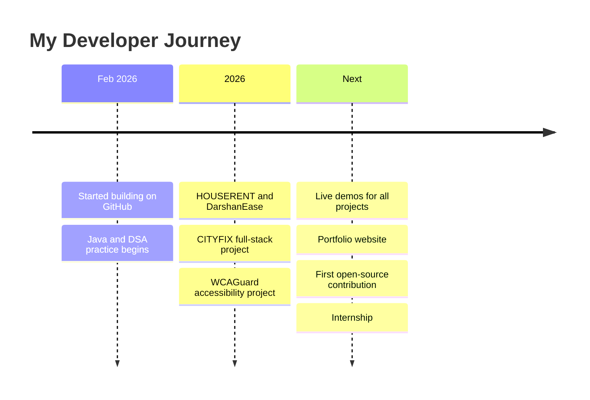
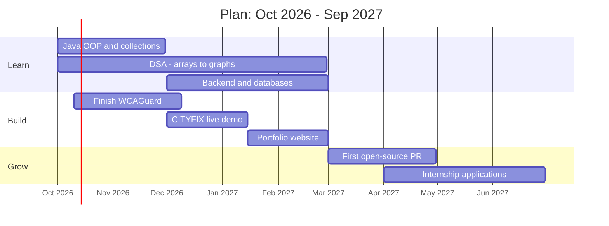
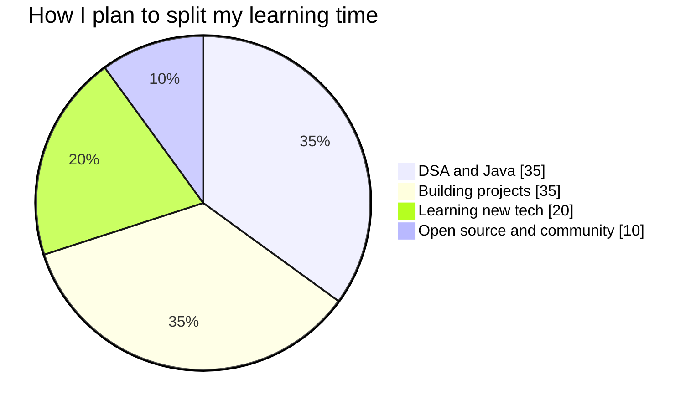

<div align="center">


<br/>

<table>
  <tr>
    <td align="center" width="210">
      
    </td>
    <td align="left">
      <h2>👋 Hey, I'm Venu Gopal Varma</h2>
      <p>🎓 B.Tech CSE student building real-world software<br/>
      ☕ Java + DSA &nbsp;•&nbsp; 🌐 Full-stack web &nbsp;•&nbsp; ♿ Accessibility<br/>
      📍 Andhra Pradesh, India</p>
      <a href="https://www.linkedin.com/in/venugopalvarmabattula/"></a>
      <a href="mailto:venug2762@gmail.com"></a>
    </td>
  </tr>
</table>

<br/>


[](https://github.com/BVG-VARMA?tab=followers)
[](https://github.com/BVG-VARMA?tab=repositories)


</div>

<br/>

> [!TIP]
> **Open to internships and collaborations.** If you like what you see, say hi on [LinkedIn](https://www.linkedin.com/in/venugopalvarmabattula/) or [email me](mailto:venug2762@gmail.com).

---

## 👨‍💻 whoami

```js
const venu = {
  name: "Venu Gopal Varma",
  role: "B.Tech CSE Student & Developer",
  location: "Andhra Pradesh, India",
  currentlyBuilding: ["WCAGuard", "CITYFIX"],
  currentlyLearning: ["Java OOP", "DSA", "Full-stack web", "Machine Learning basics"],
  funFact: "I learn best by building things that solve real problems",
  motto: "Stay curious. Keep building. Improve every day."
};
```

---

## ⚡ Right Now

<table>
  <tr>
    <td width="25%" align="center"><h3>🔨 Building</h3>WCAGuard<br/>CITYFIX improvements</td>
    <td width="25%" align="center"><h3>📖 Learning</h3>Java OOP<br/>DSA in Java</td>
    <td width="25%" align="center"><h3>🎯 Focusing on</h3>Full-stack web<br/>Clean code and Git</td>
    <td width="25%" align="center"><h3>🔎 Looking for</h3>Internships<br/>Open-source projects</td>
  </tr>
</table>

---

## 🧰 Tech Stack

<div align="center">


</div>

<table align="center">
  <tr>
    <td align="center"><b>💻 Languages</b></td>
    <td>Java • Python • C • C++ • JavaScript</td>
  </tr>
  <tr>
    <td align="center"><b>🌐 Web</b></td>
    <td>HTML5 • CSS3 • JavaScript • Node.js • React</td>
  </tr>
  <tr>
    <td align="center"><b>🗄️ Databases</b></td>
    <td>MySQL • MongoDB</td>
  </tr>
  <tr>
    <td align="center"><b>🔧 Tools</b></td>
    <td>Git • GitHub • VS Code</td>
  </tr>
  <tr>
    <td align="center"><b>🧠 Core CS</b></td>
    <td>Data Structures & Algorithms • OOP • Automata Theory</td>
  </tr>
</table>

---

## 📈 Skill Levels

```text
Java              ██████░░░░  60%
DSA               █████░░░░░  50%
HTML / CSS        ███████░░░  70%
JavaScript        ██████░░░░  60%
Python            █████░░░░░  50%
Git & GitHub      ██████░░░░  60%
Problem Solving   ██████░░░░  60%
```

---

## 💡 What I Do

<table>
  <tr>
    <td width="33%" valign="top">

### 🛠️ Build
Full-stack web apps that solve real problems, like reporting civic issues or simplifying everyday information.

</td>
    <td width="33%" valign="top">

### 🧩 Solve
Practice data structures and algorithms in Java to write efficient, well-structured code.

</td>
    <td width="33%" valign="top">

### ♿ Include
Care about accessibility, so websites work for everyone, not only some users.

</td>
  </tr>
</table>

---

## 🚀 Featured Projects

<table>
  <tr>
    <td width="50%" valign="top">

### 🏙️ CITYFIX
**Full-stack civic issue management system** connecting citizens and local authorities. Citizens report issues with images, descriptions and location. Administrators track, manage and resolve them.


[🔗 View Repository](https://github.com/BVG-VARMA/CITYFIX)

</td>
    <td width="50%" valign="top">

### 🛕 DarshanEase
**Web application** that simplifies accessing and managing darshan-related information with a clean, user-friendly interface.


[🔗 View Repository](https://github.com/BVG-VARMA/DarshanEase)

</td>
  </tr>
  <tr>
    <td width="50%" valign="top">

### ♿ WCAGuard *(in progress)*
**Web accessibility project** that helps identify accessibility issues and promotes inclusive web experiences.


[🔗 View Repository](https://github.com/BVG-VARMA/WCAGuard)

</td>
    <td width="50%" valign="top">

### 🏠 HOUSERENT
**Web-based house rental application** built to practice frontend and application development.


[🔗 View Repository](https://github.com/BVG-VARMA/HOUSERENT)

</td>
  </tr>
  <tr>
    <td width="50%" valign="top">

### ☕ java-dsa
**Java and DSA practice** covering concepts, implementations and problem solving.


[🔗 View Repository](https://github.com/BVG-VARMA/java-dsa)

</td>
    <td width="50%" valign="top">

### 🧮 DFA-Minimization
**Theory of computation project** on minimizing deterministic finite automata.


[🔗 View Repository](https://github.com/BVG-VARMA/DFA-Minimization)

</td>
  </tr>
</table>

---

## 🗺️ My Journey & Roadmap


---

## ⏳ Developer Timeline



---

## 🗓️ 12-Month Plan



---

## 🥧 Weekly Focus



---

## 📊 GitHub Analytics

<div align="center">


<br/><br/>


</div>

---

## 🐍 Contribution Snake

<div align="center">

<picture>
  <source media="(prefers-color-scheme: dark)" srcset="https://raw.githubusercontent.com/BVG-VARMA/BVG-VARMA/output/github-snake-dark.svg"/>
  
</picture>

</div>

---

## 🚧 Upcoming Projects

| Project | Idea | Status |
|---------|------|--------|
| 🌐 **Portfolio Website** | Personal site with projects, resume and contact form | 🔵 Planned |
| ♿ **WCAGuard v2** | More accessibility checks with clear fix suggestions | 🟡 In progress |
| 🏙️ **CITYFIX Live Demo** | Deploy online with screenshots and a demo video | 🔵 Planned |
| 🤖 **ML Mini Project** | Small machine learning project with Python | 🔵 Planned |
| ☕ **DSA Tracker** | Track solved problems by topic | 🔵 Planned |

---

## 🎯 Goals

| ⏱️ Timeline | 🎯 What I'm aiming for |
|------------|------------------------|
| **Next 3 months** | Solve DSA problems consistently • Finish WCAGuard & CITYFIX • Add demos and screenshots to every project |
| **6-12 months** | First open-source contribution • Portfolio website • Deployed full-stack project • Internship |
| **Long term** | Strong full-stack developer • Build software people use • Explore machine learning • Mentor beginners |

---

## 📚 Learning Roadmap

| Area | Topics | Status |
|------|--------|--------|
| **Core Java** | OOP, collections, exceptions, streams | 🟡 In progress |
| **DSA** | Arrays, strings, recursion, trees, graphs, DP | 🟡 In progress |
| **Web Frontend** | HTML, CSS, JavaScript, responsive design | 🟢 Building |
| **Backend** | APIs, authentication, databases | 🟡 Learning |
| **Git & GitHub** | Branching, PRs, open-source workflow | 🟡 Learning |
| **Machine Learning** | Python, NumPy, Pandas, basic models | 🔵 Planned |

---

## 🧠 DSA & Java Tracker

<details>
<summary><b>📂 Click to expand my topic checklist</b></summary>

<br/>

**Data Structures & Algorithms**
- [x] Arrays and strings
- [ ] Recursion and backtracking
- [ ] Linked lists
- [ ] Stacks and queues
- [ ] Hashing
- [ ] Trees and BST
- [ ] Heaps
- [ ] Graphs (BFS / DFS)
- [ ] Sorting and searching
- [ ] Dynamic programming

**Core Java**
- [x] Syntax and control flow
- [x] OOP basics (classes, objects)
- [ ] Inheritance and polymorphism
- [ ] Collections framework
- [ ] Exception handling
- [ ] Streams and lambdas
- [ ] Multithreading basics

**Web Development**
- [x] HTML and CSS
- [x] JavaScript basics
- [ ] Responsive design in depth
- [ ] REST APIs
- [ ] Authentication
- [ ] Deployment

</details>

---

## ✅ Progress Tracker

- [x] Created my GitHub profile README
- [x] Built a full-stack project (CITYFIX)
- [x] Started DSA practice in Java
- [ ] Add live demos to all featured projects
- [ ] Complete WCAGuard
- [ ] Solve 200+ DSA problems
- [ ] First open-source contribution
- [ ] Build my portfolio website
- [ ] Land my first internship

---

## ⏰ Daily Routine

| Step | What I do |
|------|-----------|
| 📚 **Learn** | One new concept (Java / DSA / Web) |
| 🧩 **Practice** | Solve 1-2 problems |
| 🛠️ **Build** | Add something to a project |
| 📝 **Reflect** | Note what I learned and commit it |

---

## 💬 Ask Me About

`Java` &nbsp; `DSA` &nbsp; `Web Development` &nbsp; `Accessibility (WCAG)` &nbsp; `Git & GitHub` &nbsp; `Automata Theory` &nbsp; `Starting out in CSE`

---

## 🏅 Achievements & Certifications

<!--
Remove these comment markers and add your real achievements.

| Year | Achievement | Issuer |
|------|-------------|--------|
| 2026 | Your certificate name | Coursera / NPTEL / etc. |
| 2026 | Hackathon / contest result | Event name |
-->

*Adding my certifications, hackathons and contest results here soon.*

---

## 🌐 Coding Profiles

<!--
Remove these comment markers and put your real usernames.

[](https://leetcode.com/YOUR_USERNAME)
[](https://www.hackerrank.com/YOUR_USERNAME)
[](https://auth.geeksforgeeks.org/user/YOUR_USERNAME)
[](https://www.codechef.com/users/YOUR_USERNAME)
-->

---

## ❓ FAQ

<details>
<summary><b>What are you working on right now?</b></summary>
<br/>
WCAGuard, an accessibility project, and improving CITYFIX, my full-stack civic issue system.
</details>

<details>
<summary><b>How can we collaborate?</b></summary>
<br/>
I'm open to student projects, hackathons and beginner-friendly open source. Message me on LinkedIn or email.
</details>

<details>
<summary><b>What are you learning next?</b></summary>
<br/>
Advanced DSA topics in Java, backend development with databases, and machine learning basics.
</details>

<details>
<summary><b>Are you looking for internships?</b></summary>
<br/>
Yes. I'm looking for software development and web development internships where I can learn and contribute.
</details>

---

## ⭐ Support

If any of my projects helped you or inspired you, a star on the repo means a lot and keeps me motivated to build more.

---

## 💼 Open To

✅ Internships &nbsp;•&nbsp; ✅ Collaboration on student & open-source projects &nbsp;•&nbsp; ✅ Hackathons &nbsp;•&nbsp; ✅ Mentorship

---

<div align="center">

### 🤝 Let's Connect

[](https://www.linkedin.com/in/venugopalvarmabattula/)
[](mailto:venug2762@gmail.com)
[](https://github.com/BVG-VARMA)

<br/>

*"Small steps every day lead to big results."*

<br/>


</div>
